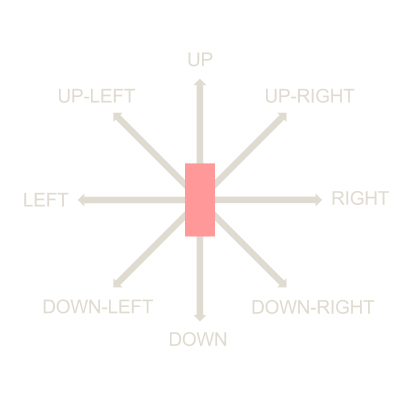
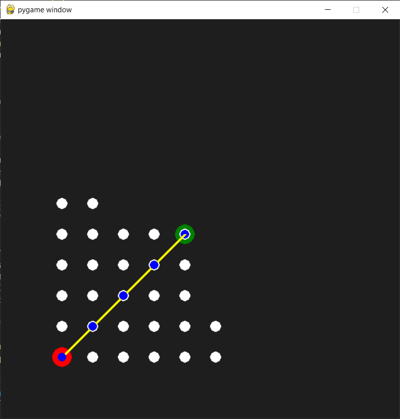
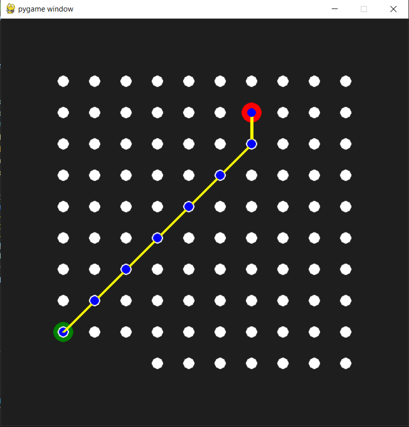
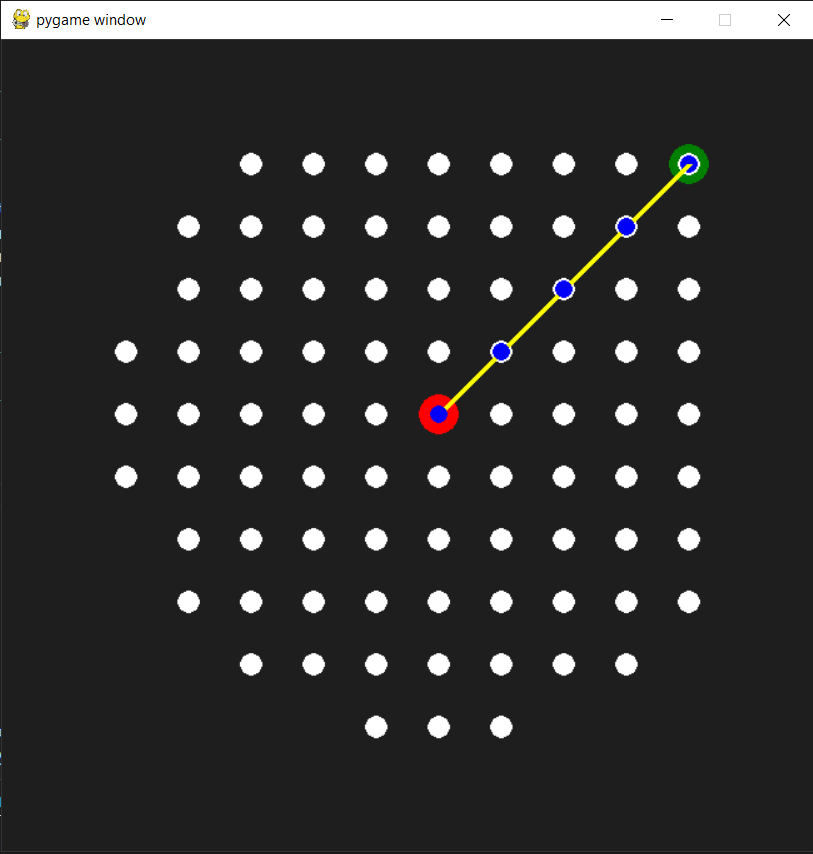
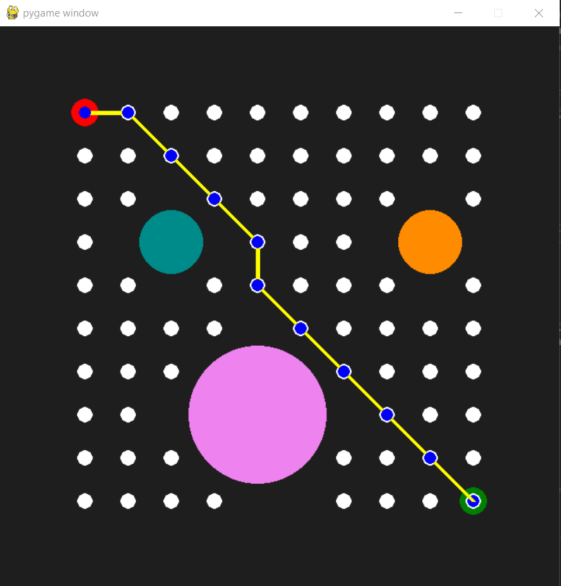
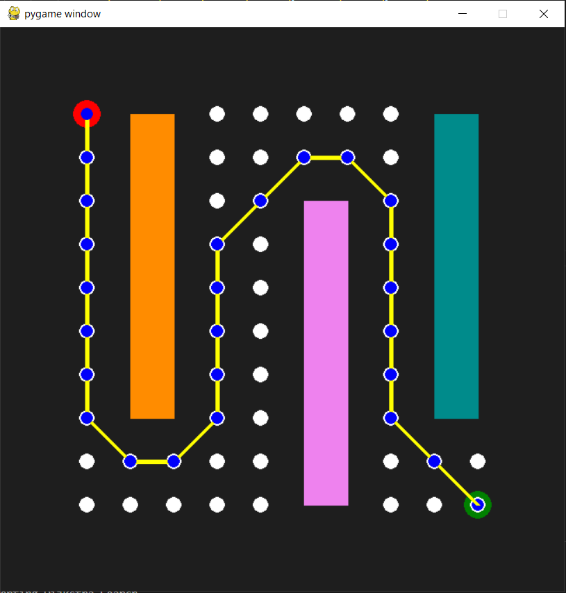
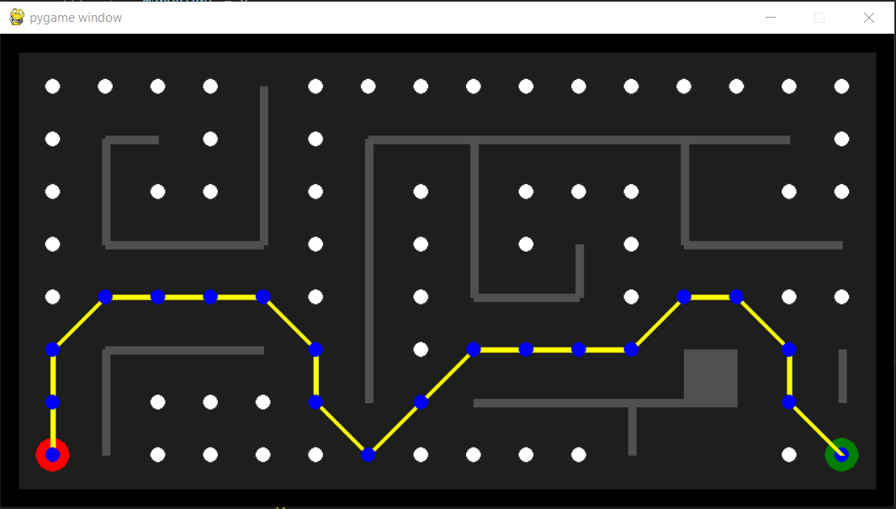

# Dijkstra Algorithm

### Task:

Implement Dijkstra algorithm on a map between a given start and goal node. The repository contains 3 files:

- **Dijk_emptyMap.py** - The 10 x 10 map is empty. The script finds dijkstra generated path between a start and goal node.
- **Dijk_obsMap.py** - The 10 x 10 map has obstacles. The script finds the dijkstra generated path between two nodes while avoiding obstacle space. There algorithm can be implemented on two maps.  Set the variable 'mapNumber' to 1 or to 2 in the main function to switch between maps.
- **Dijk_Maze.py** - Maze Map of size 16 x 8. The script finds dijkstra generated path between two nodes.
        
### Path is visualized using pygame. 
- Start Node is Red
- Goal Node is Green
- Solution Path is in Blue/Yellow
- Explored Nodes are in White

### 8 action steps. Search Sequence: 

        Up --> UpRight --> Right --> DownRight --> Down --> DownLeft --> Left --> UpLeft

        

### Evaluation Function

The evaluation function $f(n)$ for Dijkstra Algorithm is: $ f(n) = g(n) $. Here, $g(n)$ is the operating cost function that measures the cumulative cost of each individual step taken to reach a given node. In the queue, the node with the smallest $f(n)$ value is explored first. 

## Empty Map Results 

Start Node:(1,1) --> Goal Node:(5,5) |  Start Node:(7,9) --> Goal Node:(1,2)| Start Node:(6,6) --> Goal Node:(10,10)
:-------------------------:|:-------------------------:|:-------------------------:
  |  | 

## Obstacle Map Results 

Map 1: (1,10) --> (10,1)   |  Map 2: (1,10) --> (10,1) 
:-------------------------:|:-------------------------:
  |  

## Maze Map Results

        Start Node:(1,1) --> Goal Node:(16,1)

       

## License
[MIT](https://choosealicense.com/licenses/mit/)

## Acknowledgements

 - [101 Computing - Dijkstra’s Shortest Path Algorithm](https://www.101computing.net/dijkstras-shortest-path-algorithm)
 - [Medium Article](https://medium.com/basecs/finding-the-shortest-path-with-a-little-help-from-dijkstra-613149fbdc8e)
 - [Planning Algorithms, LaValle, Chapter 2](http://lavalle.pl/planning/ch2.pdf)

## Support
For any questions, email me at jaisharm@umd.edu
